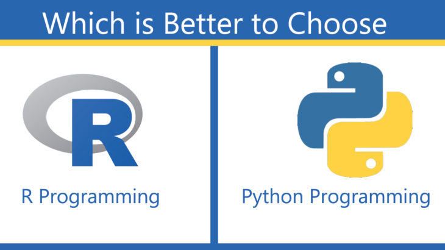
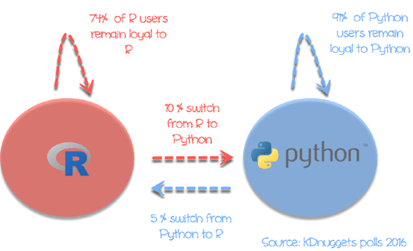
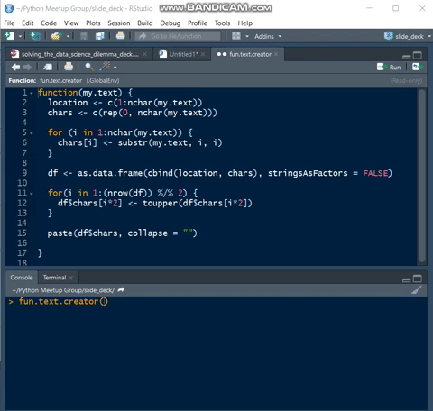
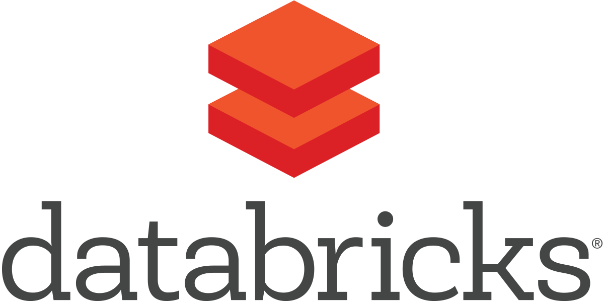

```{r setup, include=FALSE}
knitr::opts_chunk$set(echo = FALSE, message = FALSE, warning = FALSE)
```

## About Me {.flexbox .vcenter}


## Until Now {.flexbox .vcenter}

&nbsp;
&nbsp;

## You Right Now, Probably {.flexbox .vcenter}

"R iS NoT A ReAl pRoGrAmMiNg lAnGuAgE" 

- The Skeptics


## Me, Trying to Convince You Otherwise {.flexbox .vcenter}




## Why Just Pick One? {.flexbox .vcenter}


## Ursa Labs - 2018 {.flexbox .vcenter}

&nbsp;

## As of Today... {.flexbox .vcenter}

<center></center>
<center>&nbsp;&nbsp;&nbsp;</center>

## Databricks Example

[https://mthomas-ketchbrook.github.io/python_and_r_in_databricks/](https://mthomas-ketchbrook.github.io/python_and_r_in_databricks/)

## RMarkdown Example

[https://mthomas-ketchbrook.github.io/python_and_r_in_rmarkdown/](https://mthomas-ketchbrook.github.io/python_and_r_in_rmarkdown/)

## Contact Information {.flexbox .vcenter}

<br>

[mthomas@ketchbrookanalytics.com](mailto:mthomas@ketchbrookanalytics.com)

<br>
<br>

\(860) 580 - 6657
